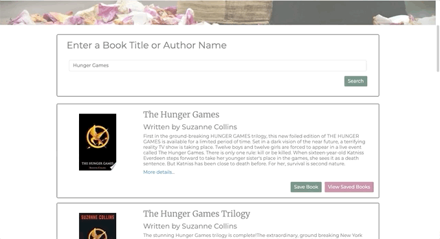
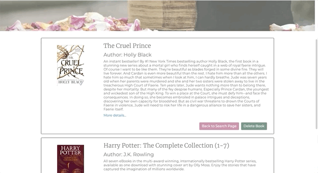
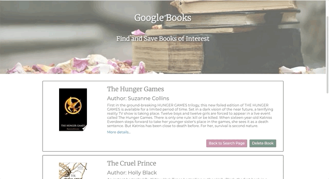
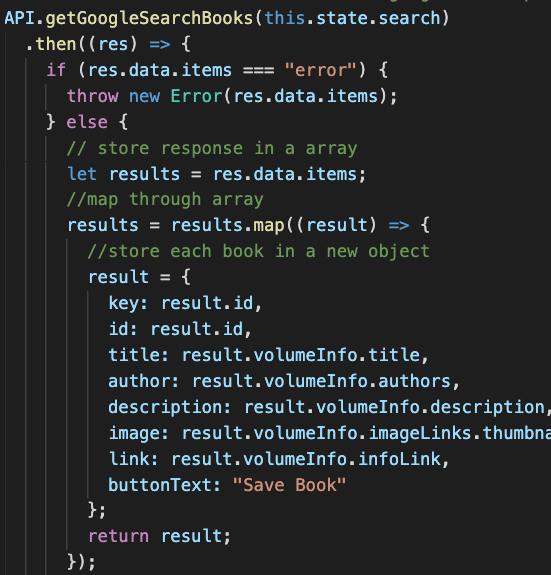
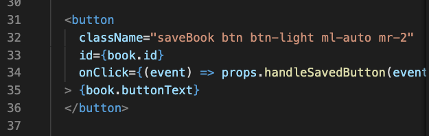
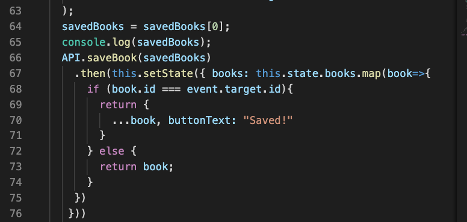

# Google Book Search

This app allows users to search for any book and save their favorite ones, and eventually delete them if they so choose too.

To accomplish this, this app uses axios to call on the **Google Books API** and deliver the content the user is searching for, **MongoDb** as the nonrelational database used to store the user's favorite books and **React** to create the beautifully functional front-end. To enable the communication between our front-end and our back-end database, we use **Express** as our server and **Mongoose** to create our database Schema. 

## Sample Images

When the user wants to search for a book, they simply have to type up what book (or author) they are searching for and hit Search. The button search will then send a request with axios and it's promise based response will deliver the results that are then rendered on the page as seen below. 


The user can choose from the results the books they want to save as their favorite. When they click on the button **Save Book**, the text of the button will change to reflect the action taken. This will save the book to our Mongo database.




The user can then travel to the Saved Books page just by clicking on the **View Saved Books** button. They also can go back to **Home** by clicking the button Back to Search Page. This buttons use the React- Router-Dom giving the front end pages routes to help better transition the user from one page to another. 

**View Saved Books Button:**


**Go Back To Search Page Button:**




Once in the View Saved Books page, the user can also choose to delete some of the books they saved. this action will delete the books stored in the Mongo database. 




The buttons on the cards are not the only way the users can transition from one page to another. Our Navbar elements also uses the React-Router-Dom. So when clicking on them, the user will go to the assigned page to find another element they can click to return to the page they just left. 


____

# Getting Started

To build this application we used a **MERN (Mongo, Express, React, Node)**structure. There were a number of packages that needed to be installed so we could effectively work both on the back-end and the front-end. 

## Back-End

To have a functional server we had to start by installing our Express package.

```
npm install express
```

We also had to install Mongoose so we could build our Schema and connect our front-end to it through our Express routes.

```
npm install mongoose
```

## Front-End

React was what we used to render our application. Since it's a Javascript based template we also had to install some packages to ensure we could communicate with our server, complete our API call and use React Router to enable us to switch between front-end pages.

The react-router-dom is the dependency that enable the switch between the "Search" and "View Saved Books"

```
npm install react-router-dom
```

Axios is was the promised based HTTP client for the browser and node that we used to complete the API request and to enable the communication with the Express routes in the back-end.

```
npm install Axios
```

## Additional Packages

There were some additional packages installed that helped with testing the app and also it's deployment to heroku where we chose to host our application.

The first one is concurrently. This package allows us to run the server and the react app at the same time without having to initiate two ports. With this package we only need to get to the root level of our application and do a "npm start" to have both the server and react initiated.

```
npm install concurrently
```
In order for concurrently to work, some changes to the package.json scripts need to be made so when "npm start" is run, the application will now what to do. Concurrently will use nodemon to start application in the development state. 

```
 "start:dev": "concurrently \"nodemon --ignore 'client/*'\" \"npm run client\""
 ```

If you don't have nodemon installed at a gobla level you will also want to install it as a dependency so it work with concurrently.

```
npm install nodemon
```

The other additional package installed was the if-env package. The if-env package helps when the package is deployed and in production mode. When the application runs, the if-env package will check to see if there are any env environments. It there are it will run the application in the production mode if not it will redirect it to the start:dev script shown above. 

```
npm install if-env
```
Just as we did with concurrently, in order for this package to work we need to modify the scripts in the package.json so it knows what to do.

```
 "start": "if-env NODE_ENV=production && npm run start:prod || npm run start:dev"
 ```

# Code Highlights

To make this application functional, there is a lot of code and logic behind it to make it work. However, sometimes the beauty is in the details. Here we want to highlight how when the user clicks  , the button text changes to .

The first step was to alter how we were rendering the text in the button. Before we had it just hard text coded in a component. 

To make it possible to change it when clicked, we included the button text inside out object results from the API request like so:



If you look at the last line of out result object, you will see the buttonText property that have the text we want to see displayed.

The next step was to go to the component where this button is being rendered and make sure to "tell it" to render the text assigned in the buttonText property.



On line 35, instead of writing **Save Book**, we pointed to the object property that contained that text. 

Lastly, we had to include code in the function that handled our **Save Button**



starting on line 67, we added a callback function that passes a map function. This allows to iterate over every **Save Book** button. 
Inside our map function we have created a if/else statement. If a button linked to a specific ID is clicked then we want to take evertyhting from that book (this is what the **...book** means), and also we want the buttonText to change to ***Saved!***. 
If the button is not clicked then just render the regular text.

### Why highlight this?
 
 We decided to highlight this portion of our code, because as React beginners we know there are ways to create the same effects or the same results as we previously did with html templates. The difference lies on how to tell the application how to do it.

# Technologies Used:  

 + [React](https://reactjs.org/) 
 - [React-Router-Dom](https://reacttraining.com/react-router/web/guides/quick-start)
 + [Bootstrap](https://getbootstrap.com/)
 - [Axios](https://www.npmjs.com/package/axios)
 + [Express](https://www.npmjs.com/package/express)
 - [Mongo](https://www.mongodb.com/)
 + [Mongoose](https://mongoosejs.com/docs/guide.html)
 - [Concurrently](https://www.npmjs.com/package/concurrently)
 + [if-env](https://www.npmjs.com/package/if-env)
 - [nodemon](https://www.npmjs.com/package/nodemon)

 # Deployment

 Our application was deployed in Heroku. Feel free to visit by clicking the link below.

 + [Google Books](https://google-books-search-171113.herokuapp.com/)

# Authors
+ Lindsey Tummond: [Portfolio]( https://lindseytummond.github.io/portfolio/)
- Niasha Ablago-Grant: [Portfolio]( https://niashagrant.github.io/updatedPortfolio/)
+ Jennifer Kruk : [Portfolio](https://jenkruk.github.io/Portfolio/)
- Sara Neves Pereira: [Portfolio]( https://saranp-33.github.io/bootstrap-portfolio/)

# License
This project is licensed under the MIT License